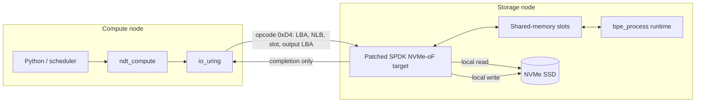

# NDT-BPE

<p align="center">
  <strong>Near-data BPE tokenization over NVMe-over-Fabrics</strong>
</p>

<p align="center">
  Move tokenization to the storage node—not the dataset to the compute node.
</p>

<p align="center">
  
  
  
  
  
</p>

NDT-BPE is a research prototype that offloads byte-pair encoding (BPE) tokenization to an NVMe-oF storage server. The compute node sends metadata-only custom NVMe commands; the storage target reads input blocks, invokes the tokenizer runtime through shared memory, and writes token IDs back to the SSD locally.

The current data path uses `Data Length=0` for opcode `0xD4`. In a 509 MB single-shard validation, measured NVMe/TCP traffic fell from 2.03 GB in the previous implementation to an average of 0.84 MB across three runs. This result demonstrates payload elimination during tokenization; it does **not** by itself establish an end-to-end speedup.

## Highlights

- Metadata-only compute-to-storage commands over NVMe/TCP
- Storage-local input reads and output writes through SPDK bdev
- Multi-slot tokenizer runtime with double-buffered shared memory and `eventfd`
- Arrow IPC text-buffer indexing and reusable NDT-native staging
- Python bindings backed by `io_uring` NVMe passthrough
- One-command patching and builds for all three components

## Architecture



NDT-BPE consists of three independently built pieces:

| Component | Location | Responsibility |
| --- | --- | --- |
| Compute client | `compute/` | Arrow metadata, FIEMAP/LBA scheduling, `io_uring`, Python API |
| SPDK target | `storage/spdk/` + `scripts/patches/` | Custom command handling and storage-local bdev I/O |
| BPE runtime | `storage/runtime/` | Shared-memory request processing and tokenization |

## Repository layout

```text
.
├── compute/                    # Compute-side C++ library and Python binding
├── storage/
│   ├── runtime/                # bpe_process, worker runtime, monitor
│   ├── spdk/                   # Pinned upstream SPDK submodule
│   └── setting.sh              # Compute-side NVMe-oF connect/mount helper
├── scripts/
│   ├── patch.sh                # Patch and build all three components
│   └── patches/
│       └── spdk-ndt-bpe.patch  # Reproducible SPDK modifications
├── .gitmodules
└── LICENSE
```

## Requirements

NDT-BPE currently targets Linux on x86-64. A two-node setup is recommended.

- Ubuntu 22.04 or a comparable Linux distribution
- A compute node and a storage node connected over TCP
- NVMe device dedicated to the SPDK target
- Python 3.12 with `venv`
- GCC/G++ with C++17 support
- CMake, Make, pkg-config, and Git
- Kernel NVMe/TCP and `io_uring` support
- Huge pages and SPDK build dependencies
- Root privileges for device binding, NVMe-oF target startup, and mounting

> [!WARNING]
> SPDK takes exclusive ownership of the configured PCI device. Verify `PCI` and `BDEV` carefully. Never bind a system or mounted data device to SPDK.

## Quick start

### 1. Clone

```bash
git clone --recurse-submodules git@github.com:doogunwo/NDT-BPE.git
cd NDT-BPE
```

### 2. Install system dependencies

On the build machine:

```bash
sudo ./storage/spdk/scripts/pkgdep.sh
```

Install `python3-venv`, `nvme-cli`, and `tmux` if they are not already available.

### 3. Patch and build

```bash
./scripts/patch.sh
```

This command:

1. initializes the pinned SPDK, liburing, and tokenizers-cpp submodules;
2. applies `scripts/patches/spdk-ndt-bpe.patch` idempotently;
3. creates `compute/venv` and builds the Python binding;
4. builds `bpe_process`, `bpe_process_main2`, and `bpe_monitor`;
5. builds the patched `nvmf_tgt`.

Useful variants:

```bash
./scripts/patch.sh --apply-only
./scripts/patch.sh --skip-spdk-build
JOBS=8 ./scripts/patch.sh
```

Build outputs:

```text
compute/venv/                              Python environment
storage/runtime/bin/bpe_process_main2      Storage runtime
storage/runtime/bin/bpe_monitor            Runtime monitor
storage/spdk/build/bin/nvmf_tgt            Patched NVMe-oF target
```

## Configuration

Create `.env` in the repository root. The file is ignored by Git.

```dotenv
TARGET_IP=192.168.1.160
STORAGE_IP=192.168.1.160
TARGET_PORT=4420
NQN=nqn.2025-01.io.spdk:cnode1
MNT=/mnt/nvme
DEV=/dev/nvme2n1
PCI=0000:03:00.0
BDEV=NVMe0
```

Adapt every value to your environment. Device node numbers such as `/dev/nvme2n1` may change after reconnecting.

## Running NDT-BPE

### Storage node: start the tokenizer runtime

```bash
cd storage/runtime
sudo ./bin/bpe_process_main2 \
  --mode=arrow \
  --exec-mode=process \
  --workers=16
```

The runtime creates per-slot shared-memory buffers and waits for the SPDK target's requests. For a background `tmux` session, use:

```bash
./storage/runtime/start_bpe_runtime.sh ndt-runtime arrow process 16
```

### Storage node: start and configure SPDK

Start the target:

```bash
sudo ./storage/spdk/build/bin/nvmf_tgt -m 0x1
```

In another terminal, bind the intended NVMe device and configure the TCP transport, subsystem, namespace, and listener with `storage/spdk/scripts/rpc.py`. Use the values from `.env`; SPDK's standard NVMe-oF target documentation describes the corresponding RPC commands.

### Compute node: connect the remote namespace

```bash
sudo modprobe nvme_tcp nvme_fabrics
./storage/setting.sh
```

`storage/setting.sh` discovers the target, connects the NQN, detects the SPDK namespace, and mounts it at `MNT`.

### Submit tokenization

```bash
source compute/venv/bin/activate
python - <<'PY'
import ndt_compute as ndt

result = ndt.tokenize_to_nvme(
    dev_path="/dev/ng2n1",
    input_path="/mnt/nvme/data-00000-of-00080.arrow",
    output_path="/mnt/nvme/data-00000-of-00080.bin",
    slots=16,
    queue_depth=64,
)
print(result)
PY
```

Use the generic character device (`/dev/ngXnY`) associated with the connected SPDK namespace. The block device (`/dev/nvmeXnY`) is used for mounting; the generic device is used for NVMe passthrough commands.

## Data path and staging

Arrow input is converted once into a reusable NDT-native staged representation. Dataset ingestion and repeated tokenization are intentionally treated as separate phases:

- **Ingestion:** parse Arrow metadata and create aligned, framed storage chunks.
- **Tokenization:** send only LBA/length/slot/output metadata and completion traffic.

Do not include first-time ingestion or output-pool creation in a steady-state tokenization measurement unless the experiment explicitly evaluates end-to-end ingestion.

## Validation snapshot

Single Arrow shard, 509,476,864 processed bytes, 3,887 commands, one runtime slot, three repetitions:

| Metric | Previous path | Metadata-only path |
| --- | ---: | ---: |
| Mean NVMe/TCP traffic | 2,034,442,416 B | 841,040 B |
| Traffic reduction | — | 99.9587% |
| Mean elapsed time | 157.753 s | 139.159 s |
| Output validation | Non-zero tokens | Non-zero tokens |

The remaining traffic is command, completion, and NVMe/TCP protocol overhead. A one-slot Ray baseline completed in 74.657 seconds in the same pilot, so performance claims require the multi-shard, multi-slot experiments rather than this transfer validation alone.

## Troubleshooting

<details>
<summary><strong>The SPDK patch does not apply</strong></summary>

The patch targets the SPDK commit pinned by this repository. Check for local submodule changes:

```bash
git -C storage/spdk status --short
git -C storage/spdk rev-parse HEAD
```

Run `./scripts/patch.sh --apply-only` after restoring the expected clean submodule checkout.
</details>

<details>
<summary><strong>The generic NVMe device changed</strong></summary>

List the namespace and its generic device after every reconnect:

```bash
sudo nvme list
ls -l /dev/ng*n* /dev/nvme*n*
```
</details>

<details>
<summary><strong>The runtime cannot open shared memory or eventfds</strong></summary>

Start the BPE runtime before submitting custom commands and verify that all workers are alive. Stale IPC objects can be removed with:

```bash
make -C storage/runtime clean_shm
```
</details>

## Project status

NDT-BPE is an active research prototype, not a production storage system. Interfaces, command layouts, staging formats, and deployment scripts may change. Current work focuses on multi-shard scaling, data-movement attribution, scheduling, and end-to-end performance evaluation.

## License

Licensed under the [Apache License 2.0](LICENSE). The SPDK submodule and third-party dependencies retain their respective licenses.
