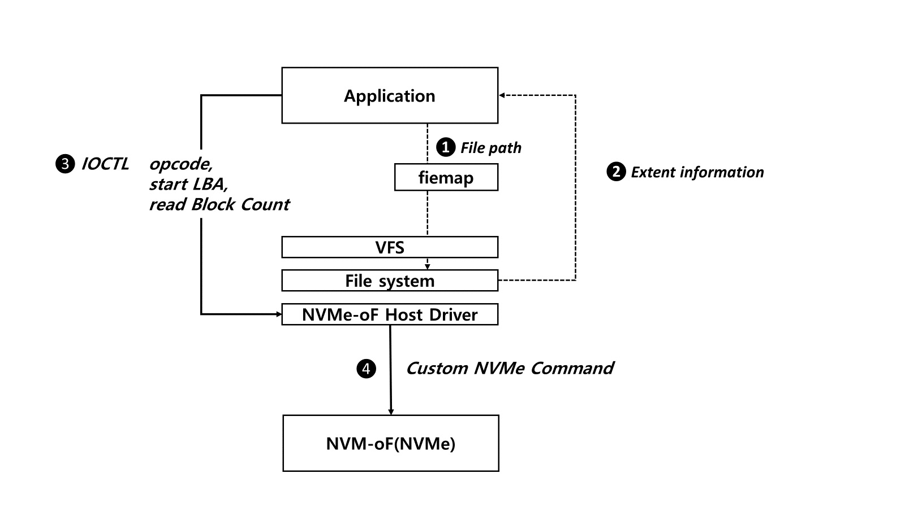
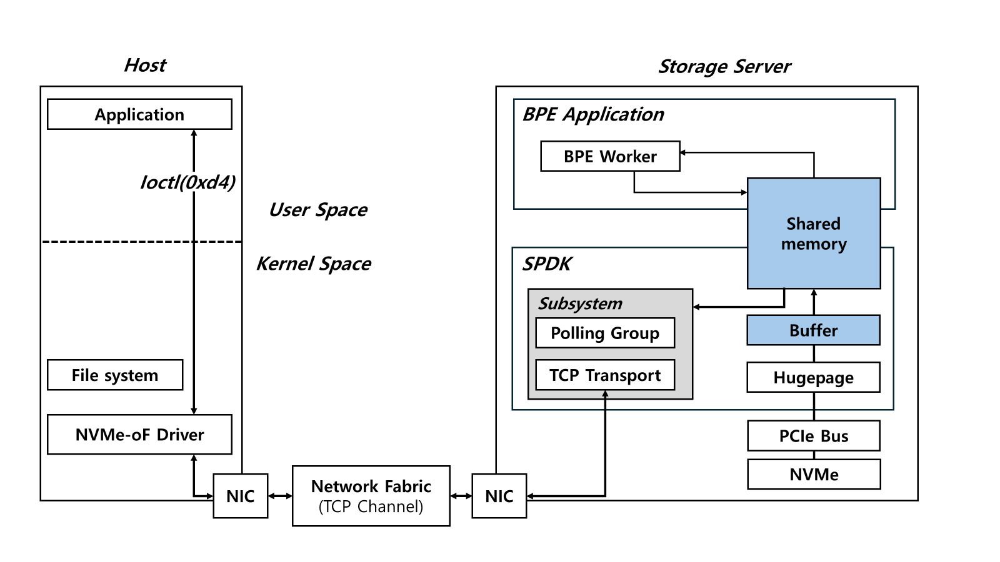

# Lightweight Near-Data Processing FrameworkBased on NVMe-over-Fabrics for BPE Tokenization
[](LICENSE)


이 폴더는 **NVMe over Fabrics** 환경에서 **Byte-Pair Encoding (BPE)** 토큰화를 스토리지 서버 측으로 오프로드함으로써, 데이터 이동 비용을 현저히 줄이고 전처리 효율을 높이는 **Near-Data Processing (NDP)** 프레임워크를 제공합니다.




본 프레임워크는:

- **SPDK** 기반 사용자 공간 NVMe-oF 타겟을 이용해 호스트-스토리지 통신을 폴링 기반 커널 바이패스 방식으로 처리  
- **System V Shared Memory** 인터페이스를 통해 I/O와 토큰화 프로세스를 경량화된 유저 스페이스 간에 직접 연결  
- 호스트 측에서는 `ioctl` 커스텀 NVMe 커맨드 한 번으로 토큰화된 결과(서브워드 ID)만 전송받음  

→ **Network traffic 최대 52%**, **Disk I/O 시간 14% 절감**를 달성했습니다.

# 1. BPE 설정
본 bpe_process 폴더는 의존성을 가집니다.!
BPE 구현은 외부 토크나이저 라이브러리를 활용합니다. 
위 프로젝트는 BPE 토큰화 기능을 위해 mlc-ai/tokenizers-cpp 라이브러리에 의존합니다. 이 라이브러리는 Hugging Face Tokenizers의 C++ 포팅으로, 다음과 같은 특징을 제공합니다

토크나이저 : https://github.com/mlc-ai/tokenizers-cpp
JSON Parser : https://github.com/nlohmann/json

```
# 2. SPDK Target server 
#!/bin/bash

NVMe 장치 unbind (SPDK에서 직접 제어하기 위해)
echo 0000:04:00.0 | sudo tee /sys/bus/pci/devices/<nvme PCI> /driver/unbind

SPDK 환경 설정 (hugepage 등)
sudo scripts/setup.sh

NVMe 컨트롤러 붙이기 (디바이스 이름은 NVMe0)
sudo scripts/rpc.py bdev_nvme_attach_controller -b NVMe0 -t PCIe -a <nvme PCI>

CUSE 등록 (필요 시)
sudo scripts/rpc.py bdev_nvme_cuse_register -n NVMe0

NVMe 디바이스 이름 확인
sudo scripts/rpc.py bdev_get_bdevs

NVMe TCP Transport 생성 (이미 있다면 오류 무시 가능)
sudo scripts/rpc.py nvmf_create_transport -t TCP || echo "Transport already exists"

NVMf Subsystem 생성 (이미 있다면 오류 무시 가능)
sudo scripts/rpc.py nvmf_create_subsystem nqn.2025-01.io.spdk:cnode1 -a -s SPDK00000000000001 || echo "Subsystem already exists"

NVMe 장치를 네임스페이스로 추가
sudo scripts/rpc.py nvmf_subsystem_add_ns nqn.2025-01.io.spdk:cnode1 NVMe0n1

리스너 등록 (클라이언트 접속 허용용)
sudo scripts/rpc.py nvmf_subsystem_add_listener nqn.2025-01.io.spdk:cnode1 -t TCP -a <IP> -s 4420
```

주요 함수: nvmf_ctrlr_process_io_cmd()
함수 위치: spdk/lib/nvmf/ctrlr.c
함수 설명: switch 문을 통해 enum으로 정의된 opcode를 기준으로 bdev 기능을 호출합니다.
```
  switch (cmd->opc) {
  case SPDK_NVME_OPC_READ:
  return nvmf_bdev_ctrlr_read_cmd(bdev, desc, ch, req);
  case SPDK_NVME_OPC_WRITE:
  return nvmf_bdev_ctrlr_write_cmd(bdev, desc, ch, req);
  case SPDK_NVME_OPC_FLUSH:
  return nvmf_bdev_ctrlr_flush_cmd(bdev, desc, ch, req);
  // CUSTOM COMMAND
  case SPDK_NVME_OPC_CUSTOM_ECHO:
  return nvmf_bdev_ctrlr_custom_echo_cmd(bdev, desc, ch, req);
  case SPDK_NVME_OPC_CUSTOM_GREP:
  return nvmf_bdev_ctrlr_custom_grep_cmd(bdev, desc, ch, req);
  ...
```

주요 함수: nvmf_bdev_ctrlr_BPE_tokenize_cmd()
함수 위치: spdk/lib/nvmf/ctrlr_bdev.c
함수 설명: 호스트의 io passthru로 부터 설정된 각종 cdw 등을 파싱하고, 첫 번째 연산에 필요한 메타데이터 파일에 대한 Read를 수행합니다. 이 Read에 대한 콜백함수로는 연산 대상파일에 대한 Read를 호출하는 함수가 등록됩니다.


사용자 정의 드라이버의 첫 번째 콜백함수가 실행됩니다.
주요 함수: nvmf_bdev_ctrlr_bpe_complete()
함수 위치: spdk/lib/nvmf/ctrlr_bdev.c
함수 설명: BPE(tokenization) 연산이 들어있는” 블록 I/O가 완료되었을 때 호출되는 콜백입니다. 블록 장치에서 읽어온 원시 데이터를 공유 메모리+메시지 큐를 통해 BPE 토크나이저로 전달하고, 처리된 결과를 다시 I/O 응답 버퍼에 복사한 뒤 NVMe-oF 응답으로 완성합니다.


# New custom dervier

### 1. opcode 등록
spdk/include/spdk/nvme_spec.h -> 
```
    enum spdk_nvme_nvm_opcode {
    ...
    SPDK_NVME_OPC_CUSTOM_ECHO = 0xd0, // opcode for custom echo,
```

### 새로운 opcode가 io로 동작하도록 구성
```
static const struct spdk_nvme_cmds_and_effect_log_page g_cmds_and_effect_log_page = {
    ...
    .io_cmds_supported = {
        ...
        /* CUSTOM ECHO */
        [SPDK_NVME_OPC_CUSTOM_ECHO]     = {1, 1, 0, 0, 0, 0, 0, 0},
        ...

```

### opcode에 대한 드라이버 함수 작성
spdk/lib/nvmf/ctrlr_bdev.c

```
int
nvmf_bdev_ctrlr_custom_echo_cmd(struct spdk_bdev *bdev, struct spdk_bdev_desc *desc,
                                struct spdk_io_channel *ch, struct spdk_nvmf_request *req)
{
 ...
 // 새로운 드라이버 기능 정의
 ...
```

### opcode 매핑
nvmf_ctrlr_process_io_cmd(spdk/lib/nvmf/ctrlr.c) 에 새로운 드라이버 함수를 정의하고 구현합니다.
```
int
nvmf_ctrlr_process_io_cmd(struct spdk_nvmf_request *req)
{
    ...
    switch (cmd->opc) {
    ...
    // CUSTOM COMMAND
    case SPDK_NVME_OPC_CUSTOM_ECHO:
        return nvmf_bdev_ctrlr_custom_echo_cmd(bdev, desc, ch, req);
```


### 드라이버 기능의 데이터 전송방향이 호스트로 향하도록 설정
spdk_nvmf_req_get_xfer(spdk/include/spdk/nvmf_transport.h)에 아래와 같은 조건문과 반환문을 추가합니다.

```
 static inline enum spdk_nvme_data_transfer
 spdk_nvmf_req_get_xfer(struct spdk_nvmf_request *req) {
 	enum spdk_nvme_data_transfer xfer;
 	struct spdk_nvme_cmd *cmd = &req->cmd->nvme_cmd;
 	struct spdk_nvme_sgl_descriptor *sgl = &cmd->dptr.sgl1;
...

if (cmd->opc == <추가하려는 Opcode>) {  // 커스텀 명령의 데이터 전송 방향을 설정
     return SPDK_NVME_DATA_CONTROLLER_TO_HOST;
}

...

```